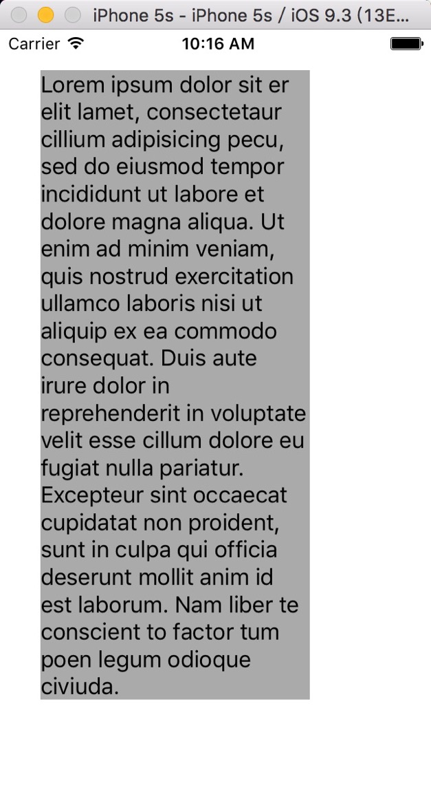

# UILabelSizeSelfAdaption
### iOS下的UILabel高度或宽度自适应
-------

## What 是什么

> iOS下UILabel高度(或宽度)根据文本内容宽度(或高度)自适应。

### 方法

#### 方法1

* `+ heightOfLabelWithString:sizeOfFont:width:`
	
	给定label宽度、字号和文字内容，计算label高度。

* ##### 方法声明
	```
	+ (CGFloat)heightOfLabelWithString:(NSString *)string sizeOfFont:(CGFloat)fontSize width:(CGFloat)wdth;
	```
	
* ##### 参数列表


	| 参数名 | 描述 |
	| ------------ | ------------- |
	| string | 给定的文字  |
	| fontSize | 给定的字号大小|
	| width | 给定的label宽度| 

* ##### 返回值
	label的高度。


#### 方法2
* `+ widthOfLabelWithString:sizeOfFont:height:`

	给定label的高度，文字内容和字号大小，计算label的宽度。

* ##### 方法声明
	```
	+ (CGFloat)widthOfLabelWithString:(NSString *)string sizeOfFont:(CGFloat)fontSize height:(CGFloat)height;
	
	```

* ##### 参数列表
	| 参数名 | 描述 |
	| ------------ | ------------- |
	| string | 给定的文字  |
	| fontSize | 给定的字号大小|
	| height | 给定的label高度|  
	
* ##### 返回值
	lable的宽度。
	
#### 方法3
**注意！** 

*该方法仅仅是为了补偿 `+ heightOfLabelWithString:sizeOfFont:width:` 方法计算label高度后文字超出label的补偿方法，布局没有问题时，没有必要使用。*

* `+ heightOfLabelWithString:sizeOfFont:width:edge:`

	给定label宽度和边距，字号、文字，计算label高度。

* ##### 方法声明
	```
	+ (CGFloat)heightOfLabelWithString:(NSString *)string sizeOfFont:(CGFloat)fontSize width:(CGFloat)width edge:(UIEdgeInsets)edge;
	
	```

* ##### 参数列表
	| 参数名 | 描述 |
	| ------------ | ------------- |
	| string | 给定的文字  |
	| fontSize | 给定的字号大小|
	| width | 给定的label宽度|
	| edge | label的上、左、下、右空白大小 |
	
* ##### 返回值
	label的高度。

#### 方法4
**注意！** 

*该方法仅仅是为了补偿 `+ widthOfLabelWithString:sizeOfFont:height:` 方法计算label宽度后文字超出label的补偿方法，布局没有问题时，没有必要使用。*

* `+ widthOfLabelWithString:sizeOfFont:height:edge:`

	给定label高度和边距，字号、文字，计算label宽度。

* ##### 方法声明
	```
	+ (CGFloat)widthOfLabelWithString:(NSString *)string sizeOfFont:(CGFloat)fontSize height:(CGFloat)height edge:(UIEdgeInsets)edge;
	
	```

* ##### 参数列表
	| 参数名 | 描述 |
	| ------------ | ------------- |
	| string | 给定的文字  |
	| fontSize | 给定的字号大小|
	| height | 给定的label高度|
	| edge | label的上、左、下、右空白大小 |
	
* ##### 返回值
	label的宽度。


## How 如何使用

1. 将 **LabelSizeHelper** 文件夹下的文件 **UILabel+LSLabelSize.h** 和 **UILabel+LSLabelSize.m** 拖入自己的工程。 
2. 引入头文件 `#import "UILabel+LSLabelSize.h"` 。
3. 调用类方法。

### 示例
```
#import "UILabel+LSLabelSize.h"
...
- (void)viewDidLoad {
    [super viewDidLoad];
    UILabel *label = [[UILabel alloc] init];
    [self.view addSubview:label];
    //不限制label的行数
    label.numberOfLines = 0;
    label.backgroundColor = [UIColor lightGrayColor];
    label.text = @"Lorem ipsum dolor sit er elit lamet, consectetaur cillium adipisicing pecu, sed do eiusmod tempor incididunt ut labore et dolore magna aliqua. Ut enim ad minim veniam, quis nostrud exercitation ullamco laboris nisi ut aliquip ex ea commodo consequat. Duis aute irure dolor in reprehenderit in voluptate velit esse cillum dolore eu fugiat nulla pariatur. Excepteur sint occaecat cupidatat non proident, sunt in culpa qui officia deserunt mollit anim id est laborum. Nam liber te conscient to factor tum poen legum odioque civiuda.";
    //固定宽度
    CGFloat width = 200;
    //自适应高度，系统默认字号为17
    label.frame = CGRectMake(30, 30, width, [UILabel heightOfLabelWithString:label.text sizeOfFont:17 width:width]);
}
```



